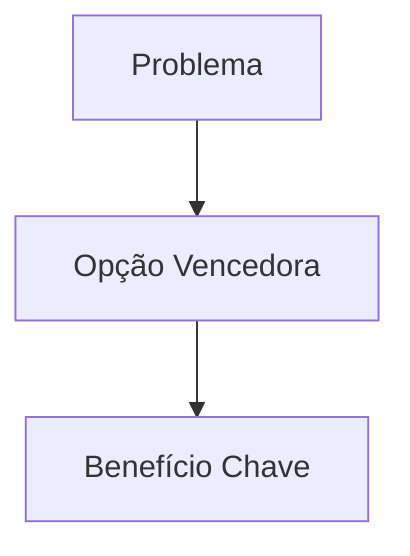

# 🔴 WORKFLOW: MESA COMPLETA (6 Fases)

> **Uso:** Decisões estratégicas que afetam o projeto como um todo OU decisões irreversíveis ("One-Way Door").
> **Exemplos:** Mudança de governança, nova linha de produto, redefinição de público-alvo, decisões com custo > R$10k ou >100h.

// turbo-all

## FASE 0: PREPARAÇÃO (Context Retrieval)

1. Identificar o TEMA da deliberação
2. Criar arquivo LOG: `GOVERNANCA/LOGS/YYYY-MM-DD_HHMM_MESA_[TEMA].md`
3. Carregar contexto dos documentos:
   - PAINEL-ESPECIALISTAS.md (Seção 0: NORTH STAR)
   - 01_MAGNA_CARTA.md (20 Princípios CM)
   - 03_MATRIZ_K12.md (se relevante)
4. Registrar no LOG: "Contexto carregado. NORTH STAR confirmado."

---

## FASE 1: EXPOSIÇÃO DIVERGENTE (Generate)

1. Selecionar especialistas relevantes (mínimo 3, máximo 7)
2. SORTEAR ordem de fala aleatoriamente
3. Para cada especialista:
   - Propor UMA SOLUÇÃO DIFERENTE (não concordar com anterior)
   - Formato: "Minha proposta é [X] porque [EMBASAMENTO]."
   - Incluir citação/referência obrigatória
4. Registrar todas as propostas no LOG

**Output:** N soluções candidatas (mínimo 3)

---

## FASE 2: VERIFICAÇÃO (Verify)

Para CADA proposta, aplicar o Checklist de 7 Critérios:

| # | Critério | Fonte | Pergunta |
|:--|:---------|:------|:---------|
| 1 | NORTH STAR | PAINEL Seção 0 | "Isso nos aproxima do objetivo central?" |
| 2 | CM Princípio #1 | MAGNA_CARTA | "Tratamos a criança como Pessoa?" |
| 3 | CM Princípio #4 | MAGNA_CARTA | "A mente foi tratada como organismo?" |
| 4 | CM Princípio #12 | MAGNA_CARTA | "Criamos relações significativas?" |
| 5 | CPA Singapura | Matriz K-12 | "Há progressão C→P→A?" |
| 6 | TGTB Estética | Manual do Ofício | "O conteúdo é belo, verdadeiro e bom?" |
| 7 | Cláusula Segurança | MAGNA_CARTA | "Evitamos proselitismo barato?" |

**Aprovação:** Mínimo 5/7 para proposta ser válida

**Output:** "Proposta A: APROVADA | Proposta B: REJEITADA (motivo)"

---

## FASE 3: PROVOCAÇÃO (External Challenger)

1. Escolher especialista EXTERNO (não listado no PAINEL):
   - Montessori, Dewey, Piaget, Waldorf, Unschoolers, Reggio Emilia
2. SORTEAR estilo (curioso OU agressivo)
3. Se necessário: fazer PESQUISA WEB para dados externos
4. Apresentar perspectiva disruptiva:
   - Curioso: "E se considerarmos que [ALTERNATIVA]?"
   - Agressivo: "Vocês erram em assumir que [PREMISSA]."
5. Registrar provocação no LOG

**Output:** "Provocação registrada. Resposta necessária."

---

## FASE 4: REFINAMENTO (Refine Loop)

Para propostas REJEITADAS ou desafiadas pela Provocação:

1. Especialista original REESCREVE sua proposta
2. Incorpora feedback da Verificação
3. CM RE-VERIFICA com o Checklist
4. Repetir até:
   - CONVERGÊNCIA: Todas as propostas restantes passam no Checklist
   - OU MAX_RODADAS: 5 iterações atingidas
   - OU SÍNTESE: Especialistas chegam a proposta unificada

**Output:** "Convergência atingida. N propostas válidas."

---

## FASE 5: VOTAÇÃO (Ensemble Selection)

Se houver múltiplas propostas válidas:

1. Cada especialista VOTA na que considera melhor
2. Formato de votação:
   | Especialista | Voto | Justificativa |
   |--------------|------|---------------|
   | CM           | A    | "..." |
   | Bruner       | B    | "..." |
3. CM tem voto de desempate (não veto)
4. Metafísico tem veto teológico
5. Registrar votos no LOG

**Output:** "Proposta A: X votos | Proposta B: Y votos"

---

## FASE 6: VEREDITO (Output + Manifest)

CM apresenta o resultado final:

### Decisão Embasada:
- **Opção Vencedora:** [X]
- **Votos:** [N]
- **Embasamento:** [Citação do princípio/especialista]

### Output Visual Obrigatório (Mermaid):

### Manifesto de Conformidade:
- NORTH STAR: ✅/❌
- 20 Princípios CM: ✅/❌ (Citados: #)
- CPA Singapura: ✅/❌
- TGTB Estética: ✅/❌
- Cláusula Segurança: ✅/❌

### Menu para o Maestro:
1. **APROVAR:** Implementar opção vencedora
2. **SOLICITAR MAIS RODADAS:** Continuar debate
3. **MODIFICAR:** Ajustar e re-verificar

---

## REFERÊNCIAS
- SSOT: GOVERNANCA/PAINEL-ESPECIALISTAS.md
- 20 Princípios: GOVERNANCA/01_MAGNA_CARTA.md
- NORTH STAR: PAINEL Seção 0
