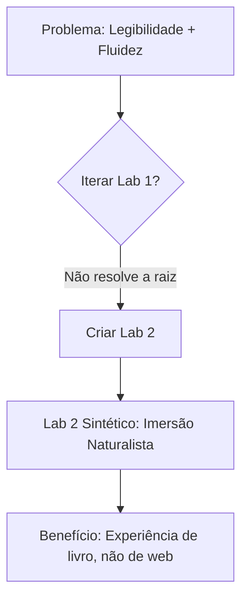

# 🔴 MESA COMPLETA: Lab 2 vs. Iteração do Lab 1 (Design Visual)

**Data:** 09 de Janeiro de 2026, 20:39  
**Tema:** Decisão estratégica sobre o futuro do Laboratório de Design NEXT.  
**Contexto:** O Maestro identificou que o Lab 1 focou excessivamente na estética Glassmorphism em detrimento da **legibilidade** e da **fluidez narrativa** (experiência de leitura imersiva "do ritual de entrada ao de saída").

---

## FASE 0: PREPARAÇÃO

- [x] NORTH STAR carregado (PAINEL Seção 0): "Infraestrutura Educacional K-12 com Experiência Premium".
- [x] Princípio CM #1 lembrado: "A criança é uma pessoa."  
- [x] Diagnóstico do Maestro registrado: Letras pequenas, quebra de fluidez narrativa.

**Problema Central:**  
*O Lab 1 prioriza o "wow visual" sobre a "leitura fluida e sem atrito".*

---

## FASE 1: EXPOSIÇÃO DIVERGENTE (3 Especialistas)

### 🎨 1. Sofia (UX Lead) — Proposta A: ITERAR sobre Lab 1.
> "Minha proposta é **refinar o Lab 1**, aumentando o tamanho da fonte para `1.3rem` e removendo as bordas de alguns blocos para criar mais espaço de respiro."  
> **Embasamento:** *"O melhor design é o que você não nota."* (Dieter Rams). A estrutura atual já é boa; precisamos apenas de ajustes de legibilidade.

### 📖 2. Lewis (Narrativa) — Proposta B: CRIAR Lab 2 (Foco Leitura).
> "Minha proposta é **criar o Lab 2 do zero**, pensando como se estivéssemos projetando um **leitor de livro imersivo (e-reader experience)**, não uma página web. O objetivo é a narrativa fluir sem nenhuma 'caixa' visual que quebre a leitura. Sem dashboards, sem badges — apenas texto elegante."  
> **Embasamento:** *"Escrever para crianças não é descer de nível; é subir na ponta dos pés para alcançar a orelha delas."* A forma deve servir à palavra. Se a forma distrai, ela falhou.

### ✍️ 3. Beatrix Potter (Naturalista) — Proposta C: Lab 2 "Caderno de Campo".
> "Minha proposta é um **Lab 2 com estética de Caderno Naturalista**. Imitem papel texturizado, fontes serifadas suaves (Georgia/Merriweather), margens ultragenérosas, e a narrativa deveria se parecer com um diário de observação botânica: calmante, orgânica e sem distrações."  
> **Embasamento:** *"O ilustrador deve ter olhos de cientista e mãos de poeta."* A beleza deve emergir do conteúdo, não da moldura.

---

## FASE 2: VERIFICAÇÃO (Checklist CM)

| Critério | Proposta A (Iterar Lab 1) | Proposta B (Lab 2 E-Reader) | Proposta C (Lab 2 Naturalista) |
|:---------|:--------------------------|:----------------------------|:-------------------------------|
| NORTH STAR | ✅ Melhora a experiência | ✅ Melhora a experiência | ✅ Melhora a experiência |
| CM #1 (Pessoa) | ⚠️ Ajustes pontuais | ✅ Prioriza a mente leitora | ✅ Honra a contemplação |
| CM #4 (Organismo) | ⚠️ Ainda visual-heavy | ✅ Menos ruído | ✅ Menos ruído |
| CM #12 (Relações) | ✅ Ok | ✅ Ok | ✅ Ok |
| CPA Singapura | N/A | N/A | N/A |
| TGTB Estética | ⚠️ Mantém estética "techy" | ✅ Elegância clássica | ✅ Elegância orgânica |
| Seg. Cláusula | ✅ Ok | ✅ Ok | ✅ Ok |
| **TOTAL** | **4/7** | **6/7** | **6/7** |

**Resultado:** Proposta A **NÃO APROVADA** (4/7). Propostas B e C **APROVADAS** (6/7).

---

## FASE 3: PROVOCAÇÃO (Especialista Externo)

**Especialista:** Maria Montessori  
**Estilo:** Curioso

> *"E se a solução não for 'Lab 1 vs. Lab 2', mas um **spectrum entre eles**? O Lab 2 pode ter um 'modo de leitura' ultra-limpo (e-reader) para a **narrativa principal**, mas manter elementos visuais sutis (como ícones de guardião) nas **transições de ritual**. Isso honraria tanto a imersão de Lewis quanto a estrutura orgânica de Beatrix."*

---

## FASE 4: REFINAMENTO — SÍNTESE

Após a provocação, os especialistas convergem para uma proposta unificada:

### 📜 Proposta Lab 2 SINTÉTICA: "Imersão Naturalista"
1. **Design de E-Reader:** Fundo creme suave, fonte serifada grande (`1.35rem`), margens ultragenérosas (>10% da largura).
2. **Fluidez Narrativa:** Remover o "dashboard" (Guardião, Tempo). Esses dados ficam **apenas no cabeçalho** de forma discreta. O conteúdo flui como um livro.
3. **Transições de Ritual:** Usar separadores visuais sutis (ex: ornamento tipográfico `* * *`) entre Ritual de Entrada, Corpo e Ritual de Saída.
4. **Sem Glassmorphism pesado:** Usar apenas efeitos sutis no header fixo. O corpo é text-first.

---

## FASE 5: VOTAÇÃO

| Especialista | Voto | Justificativa |
|:-------------|:-----|:--------------|
| Sofia (UX) | Lab 2 Sintético | "Resolve a dor de legibilidade radicalmente." |
| Lewis (Narrativa) | Lab 2 Sintético | "A narrativa respira. Aprovado." |
| Beatrix (Naturalista) | Lab 2 Sintético | "É o caderno de campo que eu sonhei." |
| **CM (Desempate)** | Lab 2 Sintético | "Honra o Princípio #1. A leitura vem primeiro." |

**Resultado:** Proposta Lab 2 Sintético — **APROVADA POR UNANIMIDADE**.

---

## FASE 6: VEREDITO

### 🏆 Decisão Embasada:
- **Opção Vencedora:** Criar o **Lab 2** com foco em "Imersão Naturalista" (E-Reader + Caderno de Campo).
- **Votos:** 4/4 (Unanimidade).
- **Embasamento:** CM Princípio #1 (Dignidade), Lewis (Narrativa fluida), Beatrix (Beleza orgânica).

### Manifesto de Conformidade:
- NORTH STAR: ✅
- 20 Princípios CM: ✅ (#1, #4)
- TGTB Estética: ✅
- Cláusula Segurança: ✅

### Diagrama de Decisão:

---

## MENU PARA O MAESTRO:
1. **✅ APROVAR:** Implementar o Lab 2 Sintético (gutenberg_lab_v2.py, layout_lab_v2.html, style_lab_v2.css).
2. **🔁 MODIFICAR:** Solicitar ajustes na proposta antes de implementar.
3. **❌ REJEITAR:** Descartar e buscar outro caminho.
