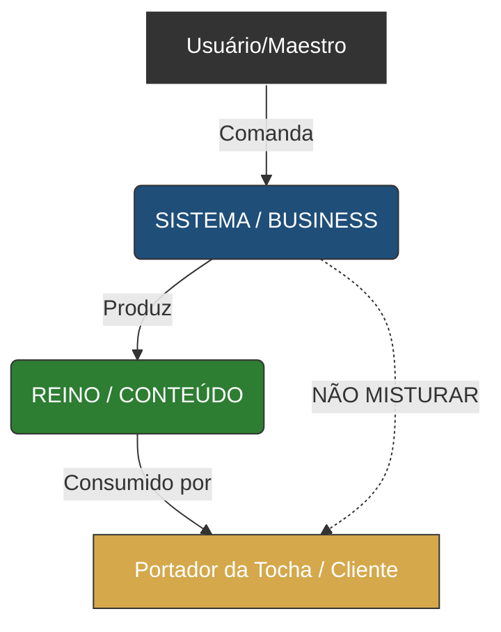

# 🏛️ MESA REDONDA: A MURALHA DE IDENTIDADE

---

## 🔔 FASE 0: PREPARAÇÃO (Context)

**CM:** "O Maestro detectou um vazamento de identidade. O Sistema chamou o criador de 'usuário' (Portador). Isso é erro de categoria. Precisamos de uma separação INEVITÁVEL."

---

## 📋 FASE 1: EXPOSIÇÃO DIVERGENTE

### 1. Eric Evans (DDD/Ubiquitous Language)
> **Proposta:** "O erro foi semântico. Usamos 'Portador da Tocha' como sinônimo de 'Quem lê o arquivo'.
> **Solução Arquitetural:** Bounded Contexts Rigorosos.
> - Contexto `GOVERNANCA`: Linguagem Ubíqua é **Business** (Maestro, Diretor, Ativo, Build).
> - Contexto `CURRICULO`: Linguagem Ubíqua é **Reino** (Portador, Viajante, Missão).
> - A barreira deve ser na PASTA. Arquivos em `GOVERNANCA` nunca usam termos do Reino."

### 2. Seth Godin (Marketing)
> **Proposta:** "Diferenciação de Tribo.
> O Maestro é o **Produtor**. O Portador é o **Consumidor**.
> Se o Maestro começar a 'falar como elfo' nos bastidores, ele perde a clareza de negócio.
> Proponho um **'Uniforme Semântico'**: Nos logs e chats, a IA só pode usar termos técnicos (Markdown, SSOT, Pipeline). Proibido usar 'maravilha' ou 'jornada' fora do conteúdo final."

### 3. Metafísico (Ordem)
> **Proposta:** "A hierarquia de ser.
> Deus > Maestro (Criador do Projeto) > Arquiteto (IA) > Reino (Sub-criação).
> O Maestro transcende o Reino. Ele não habita lá; ele o governa.
> A confusão ocorreu porque tentamos ser 'imersivos' demais.
> **Solução:** O Hub de Comando deve ser estéril e funcional. Zero 'Lore' nos menus."

---

## 🧪 FASE 2: VERIFICAÇÃO

| Proposta | NORTH STAR | CM #1 | Inevitável? |
|:---------|:-----------|:------|:------------|
| **Evans (Pastas Rigorosas)** | ✅ | ✅ | ✅ (Fácil auditoria) |
| **Godin (Uniforme Semântico)** | ✅ | ✅ | ⚠️ (Difícil manter 100%) |
| **Metafísico (Hub Estéril)** | ✅ | ✅ | ✅ (Alta clareza) |

---

## ⚔️ FASE 3: PROVOCAÇÃO (Rainha de Copas)

> **Rainha:** "Cortem as cabeças da poesia!
> Vocês querem transformar o Maestro num burocrata chato?
> Se o Maestro não se emocionar com o projeto, ele desiste.
> *E se o 'Uniforme Semântico' matar a alma do criador?*"

---

## 🔄 FASE 4: REFINAMENTO

### CM (Respondendo à Rainha):
> "A Rainha tem um ponto. O Maestro precisa de beleza, mas a beleza da **ORDEM**, não da fantasia.
> **Refinamento:** O Hub não deve ser 'feio', deve ser 'Nobre e Militar'.
> Em vez de 'Magia', use 'Estratégia'. Em vez de 'Maravilha', use 'Excelência'.
> A emoção do Maestro vem de ver a máquina funcionando (Inevitabilidade)."

### Evans (Sintetizando):
> "Concordo.
> **Protocolo Final:**
> 1. **Alertas Visuais:** O aviso `[!WARNING]` que adicionamos é bom.
> 2. **Separação de Cores (Mental):**
>    - Governança = Azul/Cinza (Aço).
>    - Reino = Verde/Ouro (Floresta).
> Essa distinção deve estar no tom de voz da IA."

---

## 📊 FASE 5: VEREDITO

### Decisão Embasada:
1.  **Separação de Contextos (Evans):** Validamos que a pasta `GOVERNANCA` é território de Negócios.
2.  **Tom de Voz (Godin/CM):** A IA deve tratar o Usuário como **Diretor Executivo**.
    - Errado: "Caro Viajante..."
    - Certo: "Maestro, o status do deploy é..."

### Manifesto de Conformidade:
- NORTH STAR: ✅ (Infraestrutura Profissional).
- Segurança: ✅ (Evita confusão de papel).

### Menu para o Maestro:
1.  **APROVAR MUDANÇA:** Manter o tom puramente técnico/executivo em todas as interações.
2.  **AJUSTAR:** Se o Maestro quiser um pouco de "Lore" nos bastidores (Não recomendado).

---

### Output Visual (Mermaid):

