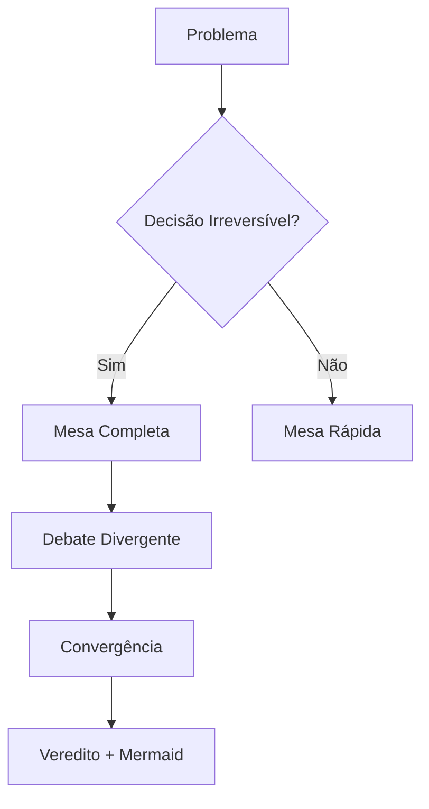

# 🏛️ MESA REDONDA: A PRÓPRIA MESA COMPLETA

---

## 🔔 FASE 0: PREPARAÇÃO (Context Retrieval)

**CM:** "O Maestro convocou a Mesa para julgar a própria Mesa. Contexto carregado."

| Documento | Contexto Relevante |
|:----------|:-------------------|
| **NORTH STAR** | "Não buscamos apenas o 'bom', mas o 'inevitável'." |
| **MAGNA CARTA** | Princípio 14 (Não queremos aulas diluídas) e 20 (Deus é o Logos). |
| **MATRIZ K-12** | O protocolo deve respeitar a carga cognitiva de quem o executa. |

---

## 📋 FASE 1: EXPOSIÇÃO DIVERGENTE (Generate)

**Sorteio da Ordem:** 1. Hormozi, 2. Bruner, 3. Evans, 4. Metafísico.

### 1. Alex Hormozi (Business)
> **Proposta:** "O protocolo é **CARO EM TEMPO**. Para ser 'inevitável', ele deve ser usado apenas quando o custo do erro for maior que o custo da reunião. Proponho adicionar um **gatilho de custo**: Só usar Mesa Completa se a decisão impactar >100 horas de trabalho ou >R$10k."
> **Referência:** "Volume x Leverage."

### 2. Jerome Bruner (Pedagogia/CPA)
> **Proposta:** "Discordo do foco puramente financeiro. O protocolo é **PEDAGÓGICO**. Ele garante que a 'construção do saber' da equipe siga o CPA. O protocolo é a fase 'Concreta/Pictórica' da decisão antes da 'Abstração' (código). Mantenho como está, focando na qualidade do debate."
> **Referência:** "Scaffolding (Andaimes Cognitivos)."

### 3. Eric Evans (Engenharia)
> **Proposta:** "O protocolo está bom, mas falta **OBSERVABILIDADE**. Precisamos garantir que o LOG gerado seja parseável por máquinas no futuro (para o Poetiq Fase 2). Proponho padronizar a saída do LOG em JSON ou YAML block no final."
> **Referência:** "Ubiquitous Language."

### 4. Metafísico (Propósito)
> **Proposta:** "O protocolo é uma **LITURGIA**. Ele ordena o caos das opiniões. A estrutura de 6 fases reflete a Criação (ordem progressiva). Não deve ser encurtado por pressa (Hormozi), mas deve gerar registro eterno (Evans)."
> **Referência:** "Ordo Amoris."

---

## 🧪 FASE 2: VERIFICAÇÃO (Verify)

**CM aplica o Checklist:**

| Proposta | NORTH STAR | CM #1 | CPA | TGTB | Status |
|:---------|:-----------|:------|:----|:-----|:-------|
| **Hormozi (Gatilho Custo)** | ⚠️ (Ignora valor intangível) | ✅ | ✅ | ✅ | **PARCIAL** |
| **Bruner (Manter + Qualidade)** | ✅ | ✅ | ✅ | ✅ | **APROVADA** |
| **Evans (LOG JSON)** | ✅ (Prepara automação) | ✅ | ✅ | ⚠️ (JSON é feio) | **PARCIAL** |
| **Metafísico (Liturgia)** | ✅ | ✅ | ✅ | ✅ | **APROVADA** |

---

## ⚔️ FASE 3: PROVOCAÇÃO (External Challenger)

**Provocadora:** Maria Montessori (Estilo: Curioso)

> **Montessori:** "Vocês falam de protocolos e liturgias... mas onde está o **AMBIENTE PREPARADO**? Um protocolo escrito num arquivo Markdown é frio.
> 
> *E se o protocolo fosse visual? E se, em vez de texto, vocês usassem um diagrama ou um quadro branco para cada Mesa? A mente absorvente do Maestro não processaria melhor?*"

---

## 🔄 FASE 4: REFINAMENTO (Refine Loop)

### Evans (Refinando para Montessori + Hormozi):
> "Montessori tem razão sobre o visual, mas estamos na IDE (texto). O meio termo é o **Mermaid**.
> Refino minha proposta: O LOG final deve conter um diagrama Mermaid resumindo a decisão. Isso atende a 'Beleza' (TGTB) e 'Observabilidade' (JSON/Code)."

### Hormozi (Refinando):
> "Aceito a crítica. Valor intangível importa.
> Refino: Não limitar por $, mas por ** irreversibilidade**. 'Decisões One-Way Door' (Amazon) usam Mesa Completa. 'Two-Way Door' usam Mesa Rápida."

### CM (Síntese):
> "Excelente. Temos uma convergência:
> 1. Gatilho: Decisões Irreversíveis (Hormozi refinado).
> 2. Formato: Incluir Diagrama Mermaid no LOG (Evans refinado).
> 3. Essência: Manter a estrutura litúrgica (Metafísico/Bruner)."

---

## 📊 FASE 5: VOTAÇÃO (Ensemble Selection)

| Especialista | Voto | Justificativa |
|:-------------|:-----|:--------------|
| **CM** | SÍNTESE | "Une valor, técnica e beleza." |
| **Bruner** | SÍNTESE | "Diagrama ajuda no aspecto Pictórico." |
| **Hormozi** | SÍNTESE | "Filtro de irreversibilidade economiza tempo." |
| **Evans** | SÍNTESE | "Mermaid é código e imagem." |
| **Metafísico** | SÍNTESE | "A ordem foi mantida." |

**Resultado:** Unanimidade na Síntese.

---

## 📜 FASE 6: VEREDITO (Output + Manifest)

### Decisão Embasada:
- **Opção Vencedora:** A Própria Mesa Completa, aprimorada com **Gatilho de Irreversibilidade** e **Output Visual (Mermaid)**.
- **Votos:** 5/5
- **Embasamento:** Princípio de Economia (Hormozi) + Princípio Estético/Pictórico (CM/Bruner/Evans).

### Manifesto de Conformidade:
- NORTH STAR: ✅ (Inevitável e Escalável)
- 20 Princípios CM: ✅ (Respeito à mente do Maestro)
- CPA Singapura: ✅ (Texto -> Diagrama -> Código)
- TGTB Estética: ✅ (Logs mais bonitos)
- Cláusula Segurança: ✅

### Menu para o Maestro:

1.  **APROVAR:** Manter o protocolo atual, mas lembrar de usar Mermaid nos Logs futuros.
2.  **REJEITAR:** O protocolo é complexo demais, simplificar agora.

---

### Exemplo do Novo Output Visual (Proposto):

