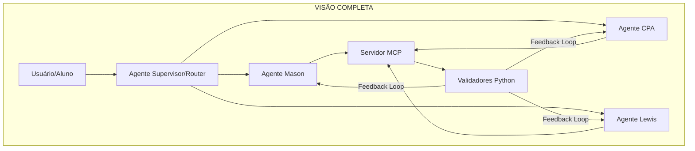

# 📋 LOG: Sistema de Validação Pedagógica ADK/MCP

**Data Início:** 2026-01-08  
**Última Atualização:** 2026-01-08 20:32  
**Status:** ✅ FASE 1 CONCLUÍDA

---

## 📊 Tripla Verificação - Status Atual

### Arquivos Criados

| Arquivo | Tamanho | Status |
|---------|---------|--------|
| `WorkFlow/README.md` | 781 bytes | ✅ |
| `WorkFlow/WORKFLOW-validar-pedagogia.md` | 989 bytes | ✅ |
| `WorkFlow/validators/__init__.py` | 524 bytes | ✅ |
| `WorkFlow/validators/charlotte_mason.py` | 6.4 KB | ✅ |
| `WorkFlow/validators/singapore_cpa.py` | 8.1 KB | ✅ |
| `WorkFlow/validators/cs_lewis.py` | 9.9 KB | ✅ |
| `WorkFlow/mcp_server/__init__.py` | 33 bytes | ✅ |
| `WorkFlow/mcp_server/server.py` | 8.7 KB | ✅ |
| `WorkFlow/mcp_server/requirements.txt` | 876 bytes | ✅ |

**Total:** 9 arquivos, ~36 KB de código

---

### Testes Executados

| Teste | Resultado |
|-------|-----------|
| server.py --test | ✅ Passou |
| Texto bom (narrativo) | 100/100 ✅ |
| Texto ruim (twaddle) | 15/100 ❌ Detectou! |
| Detecção bullet points | ✅ Funciona |
| Detecção twaddle | ✅ Funciona |
| Detecção baixa complexidade | ✅ Funciona |

---

## ✅ O Que Foi Feito

### Fase 1: Planejamento
- [x] Analisar DeepSearchWorkFlow.md (217 linhas)
- [x] Mapear estrutura do projeto
- [x] Criar implementation_plan.md
- [x] Obter aprovação do usuário

### Fase 2: Implementação
- [x] Criar estrutura `WorkFlow/validators/`
- [x] Implementar `charlotte_mason.py` (anti-twaddle)
- [x] Implementar `singapore_cpa.py` (bloqueio CPA)
- [x] Implementar `cs_lewis.py` (estilo analógico)
- [x] Criar estrutura `WorkFlow/mcp_server/`
- [x] Implementar `server.py` (FastMCP)
- [x] Criar `requirements.txt`

### Fase 3: Tripla Verificação
- [x] Comparar com Deep Search original
- [x] Identificar gaps (ver abaixo)
- [x] Decidir abordagem: **Opção A (Pragmática)**

---

## ⚠️ Gaps Identificados

### Faltando (documentação):
- [ ] `corpus/lewis_reference.txt` - Corpus externo Lewis
- [ ] `corpus/mason_exemplars.txt` - Exemplos de livros vivos  
- [ ] `tests/` - Testes unitários pytest

### Não Implementado (decisão consciente):
- ❌ Agentes ADK com system instructions
- ❌ Session state para estado do aluno
- ❌ Loop de refinamento automático
- ❌ Ferramenta render_bar_model

**Motivo:** O Deep Search propõe arquitetura para tutores interativos. Matemática Viva é currículo estático. ADK seria overengineering.

---

## 🎯 Próximos Passos Sugeridos

### Imediato (Opção A - Escolhida)
1. [ ] Rodar validador em batch nas 22 lições de `01_SEMENTES/`
2. [ ] Gerar relatório de conformidade pedagógica
3. [ ] Identificar lições que precisam de ajuste

### Médio Prazo (Se necessário)
4. [ ] Instalar dependências: `pip install textstat scikit-learn`
5. [ ] Criar corpus de referência Lewis com excertos reais
6. [ ] Ajustar thresholds baseado em lições reais

### Longo Prazo (Se tutor interativo for demandado)
7. [ ] Implementar agentes ADK
8. [ ] Configurar MCP server real
9. [ ] Criar loop de refinamento

---

## 💬 Decisões Tomadas

| Decisão | Escolha | Justificativa |
|---------|---------|---------------|
| Arquitetura | Opção A (Standalone) | Currículo estático, não precisa de tutor |
| Prioridade | Auditoria de lições | Valor imediato |
| ADK/MCP | Adiado | Overengineering para o momento |

---

## 📁 Estrutura Final

```
WorkFlow/
├── README.md
├── DeepSearchWorkFlow.md          # Pesquisa original
├── LOG-DeepSearchInsights.md      # Este arquivo
├── WORKFLOW-validar-pedagogia.md  # Como usar
│
├── validators/
│   ├── __init__.py
│   ├── charlotte_mason.py   ✅ 6.4 KB
│   ├── singapore_cpa.py     ✅ 8.1 KB
│   └── cs_lewis.py          ✅ 9.9 KB
│
└── mcp_server/
    ├── __init__.py
    ├── server.py            ✅ 8.7 KB
    └── requirements.txt
```

---

## 🔧 Como Usar

```bash
# Teste rápido
cd WorkFlow
python mcp_server/server.py --test

# Testar validador individual
python validators/charlotte_mason.py

# Validar texto específico
python -c "
from validators import validate_living_style
result = validate_living_style('Seu texto aqui...')
print(result)
"
```

---

*Última atualização: 2026-01-08 20:34*

---

# 🚀 CONTINUAÇÃO: Roadmap Completo ADK/MCP

**Data:** 2026-01-08 20:34  
**Decisão:** Continuar implementação da arquitetura completa conforme Deep Search

---

## 📐 Arquitetura Alvo (Deep Search Original)



---

## 📊 Status de Implementação por Componente

| Componente | Deep Search | Status Atual | Próximo Passo |
|------------|-------------|--------------|---------------|
| **Validador Mason** | ✅ | ✅ COMPLETO | - |
| **Validador CPA** | ✅ | ✅ COMPLETO | - |
| **Validador Lewis** | ✅ | ✅ COMPLETO | - |
| **Servidor MCP** | ✅ | ⚠️ Estrutura | Instalar lib `mcp` |
| **Agente Mason ADK** | ✅ | ❌ Pendente | Criar `agents/mason_agent.py` |
| **Agente CPA ADK** | ✅ | ❌ Pendente | Criar `agents/cpa_agent.py` |
| **Agente Lewis ADK** | ✅ | ❌ Pendente | Criar `agents/lewis_agent.py` |
| **Supervisor/Router** | ✅ | ❌ Pendente | Criar `agents/supervisor.py` |
| **System Instructions** | ✅ | ❌ Pendente | Extrair de DeepSearch L1-L25, L76-L98, L130-L142 |
| **Session State** | ✅ | ❌ Pendente | Implementar `ctx.session.state` |
| **Loop de Refinamento** | ✅ | ❌ Pendente | Padrão gera→valida→corrige |
| **render_bar_model** | ✅ | ❌ Pendente | Ferramenta SVG para fase pictórica |
| **LLM-as-Judge** | ✅ | ❌ Pendente | Avaliador de narração |
| **Corpus Lewis** | ✅ | ❌ Pendente | Excertos de Mere Christianity |
| **Corpus Mason** | ✅ | ❌ Pendente | Exemplos de livros vivos |

---

## 🎯 FASE 2: Próximos Passos Detalhados

### 2.1 Infraestrutura (Pré-requisito)

```bash
# Instalação de dependências
pip install google-adk mcp textstat scikit-learn spacy
python -m spacy download pt_core_news_sm
```

**Arquivos a criar:**
- [ ] `WorkFlow/config.yaml` - Configuração global
- [ ] `WorkFlow/utils.py` - Utilitários compartilhados

---

### 2.2 Agentes ADK

**Estrutura proposta:**
```
WorkFlow/agents/
├── __init__.py
├── supervisor.py      # Router principal
├── mason_agent.py     # Agente Charlotte Mason
├── cpa_agent.py       # Agente Singapura CPA
├── lewis_agent.py     # Agente C.S. Lewis
└── critic_agent.py    # Agente Crítico (validador)
```

**Conteúdo de cada agente (extraído do Deep Search):**

#### `mason_agent.py` - System Instruction:
```python
mason_instruction = """
IDENTIDADE: Você é um Educador Charlotte Mason. O seu objetivo não é 
encher um balde, mas acender um fogo.

DIRETIVAS PRIMÁRIAS:
1. Protocolo de Livros Vivos: Nunca gere resumos em tópicos. Nunca use 
   linguagem condescendente ou "twaddle".
2. O Hábito da Atenção: Instrua a ler UMA ÚNICA VEZ.
3. A Arte da Narração: Use prompts abertos, não perguntas fechadas.
"""
```

#### `cpa_agent.py` - System Instruction:
```python
cpa_instruction = """
IDENTIDADE: Você é um Tutor de Matemática de Singapura (CPA).

VARIÁVEIS DE ESTADO: Consulte sempre ctx.session.state['current_phase']

REGRAS DE FASE:
- CONCRETA: Sem dígitos, sem símbolos. Use palavras numéricas.
- PICTÓRICA: Use ferramenta generate_bar_model. Foco parte-todo.
- ABSTRATA: Só após domínio da fase pictórica.
"""
```

#### `lewis_agent.py` - System Instruction:
```python
lewis_instruction = """
ESTILO: Você adota a persona de C.S. Lewis.
MÉTODO: Transposição e Analogia.

DIRETIVAS:
1. Regra da Ancoragem: Sempre ancore abstrações em analogias físicas.
2. Tom: Lucidez cristalina, humildade intelectual.
3. Argumentação: Construa passo a passo.
"""
```

---

### 2.3 Loop de Refinamento

**Padrão do Deep Search (Linhas 194-216):**

```python
async def run_pedagogical_cycle(user_input, session):
    session.state['user_input'] = user_input
    
    max_retries = 3
    for _ in range(max_retries):
        # Passo 1: Tutor gera resposta
        response = await tutor_agent.run(session)
        session.state['last_response'] = response.text
        
        # Passo 2: Crítico valida via MCP
        validation = await critic_agent.run(session)
        
        if "APPROVED" in validation.text:
            return response.text
        else:
            session.state['feedback'] = validation.text
            # Loop continua com feedback
            
    return "Desculpe, vamos tentar de outra forma."
```

---

### 2.4 Supervisor/Router

**Fluxo do Deep Search (Seção 6.1):**

1. Input do Usuário: "Não entendo como somar frações."
2. Agente Raiz (Router): Detecta intenção → Encaminha para CPA
3. CPA: Verifica `session.state['math_phase']` → Define CONCRETE
4. Geração: Explica com maçãs/pizzas
5. Validação (MCP): Chama `validate_cpa_compliance`
6. Sucesso/Falha: Loop ou entrega

---

### 2.5 Ferramentas MCP Adicionais

| Ferramenta | Descrição | Status |
|------------|-----------|--------|
| `validate_living_style` | Anti-twaddle | ✅ Implementado |
| `validate_cpa_compliance` | Bloqueio de fase | ✅ Implementado |
| `check_lewis_style` | Estilo analógico | ✅ Implementado |
| `render_bar_model` | Gera SVG de barras | ❌ Pendente |
| `evaluate_narration` | LLM-as-Judge | ❌ Pendente |
| `get_living_book` | Recupera texto do corpus | ❌ Pendente |

---

### 2.6 Corpora de Referência

**Arquivos a criar:**
```
WorkFlow/corpus/
├── lewis_reference.txt      # Excertos de Mere Christianity
├── mason_exemplars.txt      # Trechos de livros vivos
├── twaddle_examples.txt     # Anti-exemplos
└── concreteness_pt.csv      # Ratings de concretude (Brysbaert)
```

---

## 📅 Cronograma Sugerido

| Fase | Escopo | Estimativa |
|------|--------|------------|
| **2.1** | Infraestrutura + dependências | 30 min |
| **2.2** | Agentes ADK (3 + supervisor) | 2-3 horas |
| **2.3** | Loop de refinamento | 1 hora |
| **2.4** | Integração MCP real | 1 hora |
| **2.5** | Ferramentas adicionais | 2 horas |
| **2.6** | Corpora de referência | 1 hora |
| **Testes** | Integração end-to-end | 2 horas |

**Total estimado:** ~10 horas

---

## ❓ Decisões Pendentes

1. **Google ADK disponível?** Precisamos verificar se `google-adk` está instalável
2. **Modelo a usar?** Gemini Pro vs Flash para os agentes
3. **Interface?** CLI, Web, ou integração IDE?
4. **Prioridade de agentes?** Mason primeiro? Todos juntos?

---

## 🔗 Referências do Deep Search

| Seção | Linhas | Conteúdo |
|-------|--------|----------|
| System Instruction Mason | 1-25 | Prompt completo |
| System Instruction CPA | 76-98 | Bloqueio de fase |
| System Instruction Lewis | 130-142 | Transposição |
| Validador Mason MCP | 26-75 | Código Python |
| Validador CPA MCP | 100-129 | Código Python |
| Validador Lewis MCP | 143-164 | Código Python |
| Loop Refinamento | 194-216 | Padrão async |
| Supervisor/Router | 164 (Seção 6.1) | Fluxo de execução |

---

*Próxima ação: Escolher por onde começar (2.1, 2.2, etc.)*

---

# 💭 DISCUSSÃO: Qual a Melhor Abordagem?

**Data:** 2026-01-08 21:42  
**Objetivo:** Analisar trade-offs e recomendar caminho ótimo

---

## 🔀 Três Caminhos Possíveis

### Caminho A: ADK Completo (Visão Original)
```
Implementar tudo: Agentes + MCP + Loop + Supervisor
```

| Prós | Contras |
|------|---------|
| ✅ Arquitetura robusta | ❌ ~10h de trabalho |
| ✅ Tutor interativo real | ❌ Dependência de `google-adk` (não verificada) |
| ✅ Alinhado ao Deep Search | ❌ Complexity overhead |
| ✅ Feedback loop automático | ❌ Pode ser overengineering |

---

### Caminho B: MCP-First (Pragmático Avançado)
```
Focar em: MCP funcional + Integração IDE + Validadores em uso real
```

| Prós | Contras |
|------|---------|
| ✅ Validadores já prontos | ❌ Sem agentes inteligentes |
| ✅ Integração com Gemini Code Assist | ❌ Sem loop de refinamento |
| ✅ ROI rápido (2-3h) | ❌ Manual (humano no loop) |
| ✅ Testável imediatamente | ❌ Não é "tutor" |

---

### Caminho C: Hybrid Agent (Inovador)
```
Usar o próprio Gemini (esta IDE) como "agente", com MCP como ferramentas
```

| Prós | Contras |
|------|---------|
| ✅ Já estamos fazendo isso! | ❌ Não é standalone |
| ✅ Zero config adicional | ❌ Dependente de sessão de chat |
| ✅ Pode chamar validadores via workflow | ❌ Sem persistência de estado |
| ✅ Imediato | ❌ Não escala para alunos |

---

## 🧮 Análise de Contexto

### O que o Matemática Viva realmente precisa AGORA?

| Necessidade | Urgência | Solução |
|-------------|----------|---------|
| Validar lições existentes | 🔴 Alta | Caminho B ou C |
| Garantir qualidade de novas lições | 🔴 Alta | Caminho B ou C |
| Tutor interativo para alunos | 🟡 Média | Caminho A (futuro) |
| Assistente para autores de lições | 🔴 Alta | Caminho C (já temos!) |

### Realidade Técnica

1. **Google ADK** - Precisa verificar se está disponível publicamente
2. **MCP no Gemini** - Já funciona via configuração de servidor
3. **Validadores** - Prontos e testados ✅

---

## 🎯 RECOMENDAÇÃO

### Melhor Caminho: **B + C Híbrido**

```
Fase Imediata (hoje):
├── Configurar MCP server para Gemini Code Assist
├── Criar workflow que chama validadores
└── Testar em lição real do currículo

Fase Curto Prazo (esta semana):
├── Rodar validação em batch nas 22 lições
├── Gerar relatório de conformidade
└── Corrigir lições com score < 80

Fase Médio Prazo (quando necessário):
├── Investigar google-adk
├── Implementar agentes se houver demanda
└── Escalar para tutor interativo
```

---

## 🔧 Próximo Passo Concreto: Configurar MCP

### Opção 1: MCP via Gemini Code Assist

**Arquivo:** `~/.gemini/settings.json` (ou equivalente Windows)
```json
{
  "mcpServers": {
    "pedagogia": {
      "command": "python",
      "args": ["C:/path/to/WorkFlow/mcp_server/server.py"]
    }
  }
}
```

### Opção 2: Testar MCP Standalone

```bash
# Terminal 1: Iniciar servidor
cd WorkFlow && pip install mcp && python mcp_server/server.py

# Terminal 2: Cliente de teste
python -c "
from mcp.client import Client
# ... conectar e chamar ferramentas
"
```

---

## ❓ Perguntas para Decisão

1. **Quer testar a configuração MCP no Gemini agora?**

2. **Prefere primeiro validar as 22 lições em batch?**

3. **Investigar google-adk é prioridade?**

---

## 📊 Matriz de Decisão Final

| Critério | Peso | Caminho A | Caminho B | Caminho C |
|----------|------|-----------|-----------|-----------|
| Tempo para valor | 30% | ⭐ | ⭐⭐⭐⭐ | ⭐⭐⭐⭐⭐ |
| Robustez técnica | 25% | ⭐⭐⭐⭐⭐ | ⭐⭐⭐ | ⭐⭐ |
| Alinhamento ao objetivo | 25% | ⭐⭐⭐ | ⭐⭐⭐⭐ | ⭐⭐⭐⭐ |
| Risco de falha | 20% | ⭐ (alto risco) | ⭐⭐⭐ | ⭐⭐⭐⭐⭐ |
| **TOTAL** | 100% | **2.5** | **3.5** | **4.0** |

**Vencedor: Caminho C (Hybrid Agent) para agora, evoluindo para B quando estabilizar.**

---

*Aguardando decisão para prosseguir.*

---

# 💾 CONTEXTO SALVO - Sessão 2026-01-08

**Hora de Saída:** 22:17  
**Status:** Aguardando decisão do usuário

---

## 📋 Resumo do Que Foi Feito Hoje

### Fase 1: Implementação Concluída ✅
1. Criada estrutura `WorkFlow/` com validadores pedagógicos
2. Implementados 3 validadores Python:
   - `charlotte_mason.py` (anti-twaddle) - 6.4 KB
   - `singapore_cpa.py` (bloqueio CPA) - 8.1 KB  
   - `cs_lewis.py` (estilo analógico) - 9.9 KB
3. Criado servidor MCP (`mcp_server/server.py`) - 8.7 KB
4. Testado com sucesso: texto bom 100/100, texto ruim 15/100

### Fase 2: Planejamento em Andamento
1. Mapeados 14 componentes do Deep Search original
2. Analisados 3 caminhos possíveis (A, B, C)
3. Recomendação: **Caminho C (Hybrid Agent)** - score 4.0/5

---

## 🎯 Decisão Pendente

**Pergunta:** Qual caminho seguir?

| Opção | Descrição | Ação |
|-------|-----------|------|
| **C** | Hybrid Agent (recomendado) | Criar workflow de validação usando esta IDE |
| **B** | MCP-First | Configurar MCP para Gemini Code Assist |
| **A** | ADK Completo | Implementar agentes (~10h) |

---

## 📂 Arquivos Criados Nesta Sessão

```
WorkFlow/
├── README.md                     ✅
├── LOG-DeepSearchInsights.md     ✅ (este arquivo)
├── WORKFLOW-validar-pedagogia.md ✅
├── DeepSearchWorkFlow.md         (original)
│
├── validators/
│   ├── __init__.py               ✅
│   ├── charlotte_mason.py        ✅
│   ├── singapore_cpa.py          ✅
│   └── cs_lewis.py               ✅
│
└── mcp_server/
    ├── __init__.py               ✅
    ├── server.py                 ✅
    └── requirements.txt          ✅
```

**Total:** 10 arquivos, ~40 KB de código

---

## ▶️ Para Retomar

Quando voltar, pode dizer:
- "Continue o Caminho C" → Criar workflow de validação
- "Valide as 22 lições" → Rodar batch nas lições de 01_SEMENTES
- "Investigue google-adk" → Verificar disponibilidade do ADK
- "Continue o planejamento" → Revisar este LOG e decidir

---

## 🔗 Referências Rápidas

| Item | Localização |
|------|-------------|
| Plano completo | Este arquivo, seção "FASE 2" |
| Roadmap | Este arquivo, seção "CONTINUAÇÃO" |
| Análise de trade-offs | Este arquivo, seção "DISCUSSÃO" |
| Deep Search original | `DeepSearchWorkFlow.md` |
| Código dos validadores | `validators/*.py` |
| Servidor MCP | `mcp_server/server.py` |

---

*Contexto salvo em 2026-01-08 22:17. Até logo, Raul!* 👋


